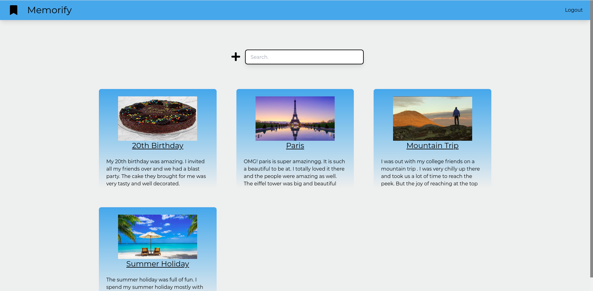
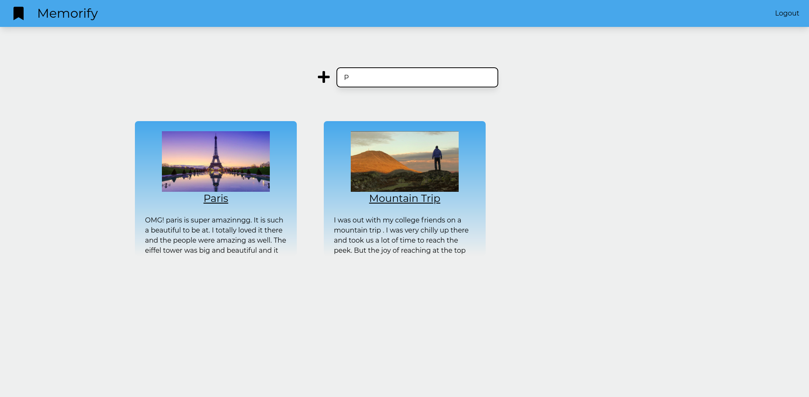
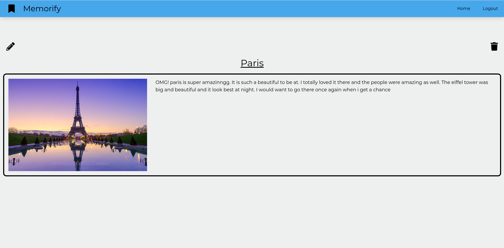
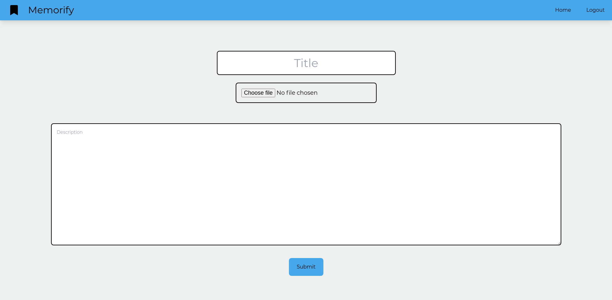

# Memorify

Memorify is a place where you can store you memories in todays date people tend to get a lot busy in their life so this will help them remember the past happy times.

## Features

-   Login and Sign Up into your account
-   Make new memories with photos
-   Edit and delete the memories
-   View single memories

## Future updates

-   Making the responsiveness better
-   Better design
-   Account recovery Features

## Build with

-   [React.js](https://reactjs.org) : For the front-end
-   [Tailwindcss](https://tailwindcss.com/) : For the design
-   [Express](https://expressjs.com/) : Backend framework
-   [Node.js](https://nodejs.org/en/) : For backend
-   [MongoDB](https://www.mongodb.com/) : For the database
-   [Cloudinary](https://cloudinary.com/) : For storing the images

## Screenshots

#### Login Page

#### Register Page

#### Home Page

#### Searhed Results

#### View Page

#### Add new memory

## To Run

-   Clone into repo
-   Run `npm install`
-   Set the environment variables

| Parameter               |
| :---------------------- |
| `CLOUDINARY_NAME`       |
| `CLOUDINARY_API_KEY`    |
| `CLOUDINARY_API_SECRET` |
| `NODE_ENV`              |
| `jwtSecret`             |
| `mongoURI`              |

-   Run `cd client`
-   Run `npm install`
-   Run `cd ..`
-   Run `npm run dev`

## Live Demo

https://memorify.herokuapp.com
